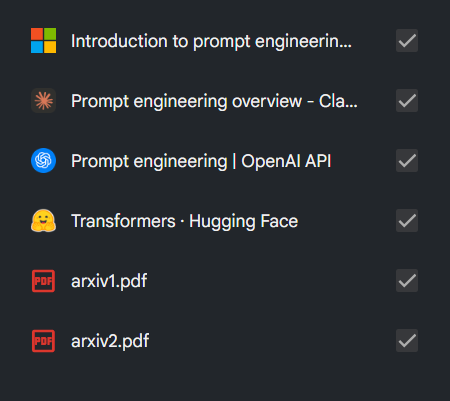
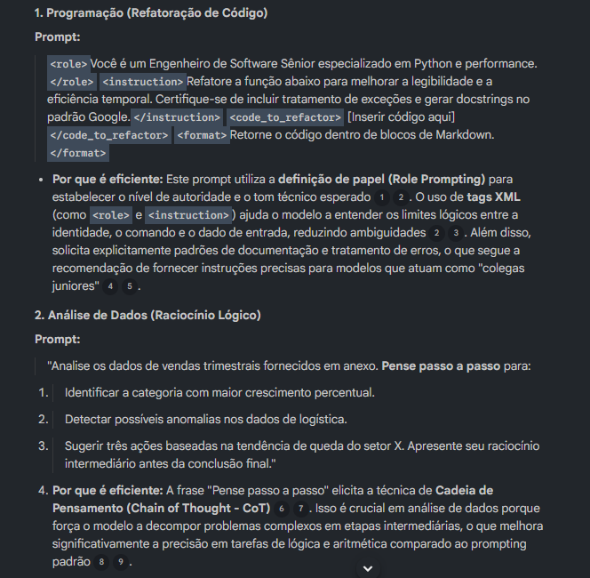
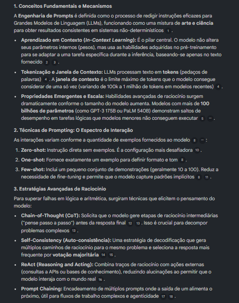
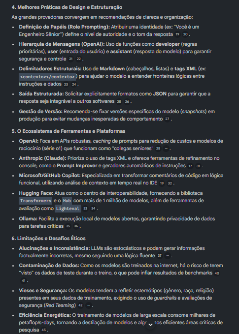

# Caderno Temático com NotebookLM — Engenharia de Prompts para LLMs

Este repositório apresenta um Caderno Temático desenvolvido no contexto do Bootcamp da DIO em Inteligência Artificial, Dados e Cibersegurança.

O projeto utiliza o NotebookLM como ferramenta de apoio à aprendizagem ativa, organização de fontes e síntese de conhecimento, com foco em **Engenharia de Prompts para Grandes Modelos de Linguagem (LLMs)**.

---

# Objetivo do Projeto

O objetivo deste projeto é desenvolver uma compreensão prática e estruturada sobre Engenharia de Prompts, explorando como diferentes instruções impactam o comportamento de modelos de linguagem.

Além disso, busca-se:

- Entender conceitos fundamentais de LLMs
- Explorar técnicas de prompting na prática
- Analisar diferenças entre abordagens de grandes empresas de IA
- Desenvolver habilidade de construção e refinamento de prompts
- Utilizar IA como ferramenta de aprendizado ativo

---

# Uso do NotebookLM

O NotebookLM foi utilizado como ferramenta central para:

- Consolidação das fontes teóricas
- Geração de sínteses e resumos estruturados
- Extração de conceitos-chave
- Apoio na construção do glossário técnico
- Organização dos tópicos de estudo

---

# Evidências de Uso do NotebookLM

Esta seção apresenta capturas de tela do uso real da ferramenta durante o desenvolvimento do projeto.

---

## Organização das fontes

---

## Execução de prompts de estudo

---

## Síntese e geração de conteúdo

---

# Curadoria de Fontes

- OpenAI — Prompt Engineering Guide  
https://platform.openai.com/docs/guides/prompt-engineering  

- Google AI — Prompt Design Guide  
https://ai.google.dev/gemini-api/docs/prompting  

- Anthropic — Prompt Engineering Overview  
https://docs.anthropic.com/en/docs/build-with-claude/prompt-engineering/overview  

- Microsoft Learn — Prompt Engineering  
https://learn.microsoft.com/training/modules/introduction-prompt-engineering-with-github-copilot/  

- GPT-3 Paper — Few-Shot Learning  
https://arxiv.org/abs/2005.14165  

- Chain-of-Thought Prompting Paper  
https://arxiv.org/abs/2201.11903  

---

# Engenharia de Prompts — Etapas de Exploração (NotebookLM)

Os prompts abaixo foram utilizados como base para investigação, organização e refinamento do conteúdo no NotebookLM.

---

## Etapa 1 — Compreensão Geral

- Visão geral sobre Engenharia de Prompts e evolução dos LLMs  
- Identificação de conceitos comuns entre diferentes fontes  
- Comparação entre abordagens (OpenAI, Google, Anthropic, Microsoft, Hugging Face)  

---

## Etapa 2 — Estudo Técnico

- Técnicas: Zero-shot, One-shot, Few-shot, Chain-of-Thought, Self-Consistency, ReAct e Tree of Thoughts  
- Funcionamento interno de LLMs (tokens, embeddings, attention, contexto)  
- Comparação estruturada entre técnicas  

---

## Etapa 3 — Aplicação Prática

- Criação de prompts para diferentes áreas (programação, dados, conteúdo, estudo e atendimento)  
- Refinamento de prompts em múltiplos níveis  
- Identificação de erros comuns em iniciantes  

---

## Etapa 4 — Revisão

- Síntese geral do conteúdo  
- Geração de glossário técnico completo  
- Criação de questões de revisão  
- Organização de mapa mental  

---

# Glossário Técnico (gerado via NotebookLM + consolidação)

## Aprendizado e Treinamento

- **Fine-tuning**: Ajuste de um modelo pré-treinado para uma tarefa específica  
- **In-context learning**: Aprendizado via exemplos no próprio prompt, sem alterar pesos  
- **Reinforcement Learning (RL)**: Aprendizado baseado em recompensas e feedback  
- **Emergent Ability**: Habilidades que surgem em modelos muito grandes  
- **Data Contamination**: Vazamento de dados de treino em testes  
- **Parameter**: Valores internos ajustados durante o treinamento  

---

## Técnicas de Prompting

- **Zero-shot**: sem exemplos  
- **One-shot**: um exemplo  
- **Few-shot**: múltiplos exemplos  
- **Chain-of-Thought**: raciocínio passo a passo  
- **Self-Consistency**: múltiplas respostas e votação  
- **ReAct**: raciocínio + ações externas  
- **Role Prompting**: definição de papel para a IA  

---

## Estrutura de Modelos

- **Token**: unidade de texto processada pelo modelo  
- **Tokenização**: divisão do texto em tokens  
- **Attention Mechanism**: foco em partes relevantes do input  
- **Context Window**: limite de memória do modelo  
- **RAG**: integração de dados externos no prompt  
- **Hallucination**: geração de informações incorretas  

---

# Engenharia de Prompts — Ciclo de Aprendizado

Durante o desenvolvimento, os prompts foram organizados em etapas progressivas:

- Estruturação de visão geral do tema  
- Exploração de conceitos técnicos fundamentais  
- Aplicação prática com geração de prompts reais  
- Refinamento e síntese do conhecimento  

---

# Reflexão

O processo demonstrou que Engenharia de Prompts não se trata apenas de formular perguntas, mas de estruturar comunicação eficiente com modelos de linguagem.

A evolução dos prompts mostrou que clareza, contexto e estrutura impactam diretamente a qualidade das respostas.

---

# Conclusão

Este projeto consolidou conhecimentos sobre Engenharia de Prompts e demonstrou o uso do NotebookLM como ferramenta de organização, aprendizado e síntese de conteúdo técnico.

---

# Meu NotebookLM

- NotebookLM — Link Público  
https://notebooklm.google.com/notebook/9f9f1803-ed23-455b-87e8-8dfad68bbb71

